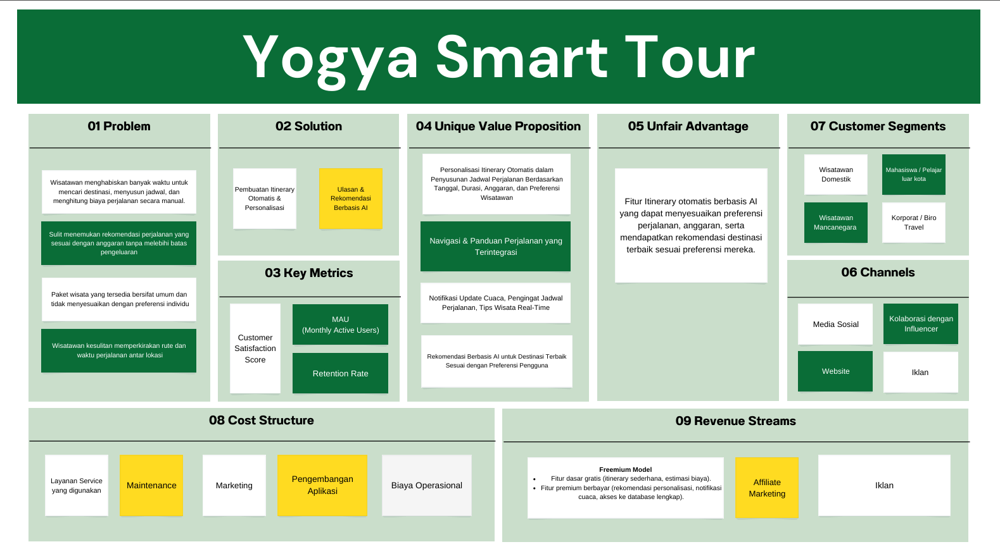

# Jogja Smart Tour

## Platform Perencanaan Wisata Yogyakarta dengan AI

<p align="center">
    
</p>

<p align="center">
    
</p>

Jogja Smart Tour adalah aplikasi web yang membantu wisatawan merencanakan perjalanan mereka di Yogyakarta dengan mudah, cerdas, dan personal melalui bantuan AI. Platform ini menggabungkan data destinasi wisata di Yogyakarta dengan teknologi AI untuk menghasilkan rekomendasi perjalanan yang sesuai dengan preferensi pengguna.

## Kelompok Warlok

- **Ketua Kelompok**: Muhammad Grandiv Lava Putra - 22/493242/TK/54023 (Project Manager, AI Engineer)
- **Anggota 1**: Syaifullah Hilmi Ma'arij - 22/497775/TK/54568 (UI/UX Designer, Software Engineer)
- **Anggota 2**: Muhammad Farrel Akbar - 22/492806/TK/53947 (AI Engineer, Cloud Engineer)

## Fitur Utama

- 🧠 **Pembuatan Itinerary dengan AI**: Buat rencana perjalanan secara otomatis berdasarkan preferensi, budget, dan durasi perjalanan
- 🗺️ **Peta Interaktif**: Visualisasi rute perjalanan dengan peta interaktif
- 📊 **Estimasi Biaya**: Perhitungan estimasi biaya transportasi, akomodasi, makanan, dan tiket masuk
- 🔍 **Pencarian & Filter Destinasi**: Cari dan filter destinasi berdasarkan kategori, harga, dan rating
- 💬 **Chatbot Asisten**: Asisten virtual yang membantu menjawab pertanyaan tentang wisata di Jogja
- 🔐 **Autentikasi Google**: Masuk dengan akun Google untuk menyimpan itinerary

## Tech Stack

### Frontend
- Next.js 13+ (React)
- TypeScript
- Tailwind CSS
- Shadcn UI
- Leaflet (untuk peta interaktif)
- Axios

### Backend
- Node.js
- Express.js
- TypeScript
- Prisma ORM
- PostgreSQL (Supabase)
- JWT Authentication
- Passport.js

### AI Integration
- Azure OpenAI API
- DeepSeek-R1 Deployment

### Deployment
- Docker
- Docker Compose

## Arsitektur Sistem

Aplikasi menggunakan arsitektur client-server dengan:
- Frontend SPA dengan Next.js
- Backend REST API dengan Express
- Database PostgreSQL di Supabase
- Integrasi AI melalui Azure OpenAI
- Autentikasi berbasis token JWT

```
┌─────────────┐           ┌─────────────┐         ┌─────────────────┐
│             │  Request  │             │ Query   │                 │
│  Next.js    │ ───────► │  Express.js │ ───────►│  PostgreSQL     │
│  Frontend   │           │  Backend    │         │  (Supabase)     │
│             │ ◄─────── │             │ ◄─────── │                 │
└─────────────┘  Response └─────────────┘         └─────────────────┘
                              │   ▲
                              │   │
                              ▼   │
                         ┌──────────────┐
                         │ Azure OpenAI │
                         │ (DeepSeek-R1)│
                         └──────────────┘
```

## Instalasi dan Setup

### Prasyarat
- Node.js v18+
- npm atau yarn
- Docker dan Docker Compose (untuk deployment)
- Akun Supabase
- Akun Azure dengan Azure OpenAI

### Setup Development

1. **Clone repository**
   ```bash
   git clone https://github.com/yourusername/jogja-smart-tour.git
   cd jogja-smart-tour
   ```

2. **Setup Backend**
   ```bash
   cd backend
   npm install
   
   # Setup environment variables
   cp .env.example .env
   # Edit .env file dengan credentials yang diperlukan
   
   # Jalankan migrasi database
   npx prisma migrate dev
   
   # Jalankan aplikasi dalam development mode
   npm run dev
   ```

3. **Setup Frontend**
   ```bash
   cd frontend
   npm install
   
   # Setup environment variables
   cp .env.example .env
   # Edit .env file sesuai kebutuhan
   
   # Jalankan aplikasi
   npm run dev
   ```

4. **Akses Aplikasi**
   - Frontend: http://localhost:3000
   - Backend API: http://localhost:5000

### Setup dengan Docker

1. **Setup environment variables**
   ```bash
   cp .env.example .env
   # Edit file .env sesuai kebutuhan
   ```

2. **Build dan jalankan dengan Docker Compose**
   ```bash
   docker-compose up -d --build
   ```

3. **Akses Aplikasi**
   - Frontend: http://localhost:3000
   - Backend API: http://localhost:5000

## Environment Variables

### Backend (.env)
```
# Server Configuration
PORT=5000
NODE_ENV=development
BACKEND_URL=http://localhost:5000
FRONTEND_URL=http://localhost:3000

# Database Configuration (Supabase)
DATABASE_URL=postgresql://...
DIRECT_URL=postgresql://...

# Azure AI Configuration
AZURE_AI_ENDPOINT=https://...
AZURE_AI_KEY=your_azure_ai_key
AZURE_OPENAI_DEPLOYMENT_NAME=DeepSeek-R1

# Authentication
JWT_SECRET=your_jwt_secret
JWT_EXPIRES_IN=24h
SESSION_SECRET=session_secret

# Google OAuth
GOOGLE_CLIENT_ID=your_google_client_id
GOOGLE_CLIENT_SECRET=your_google_client_secret
GOOGLE_CALLBACK_URL=http://localhost:5000/api/auth/google/callback
```

### Frontend (.env)
```
NEXT_PUBLIC_SUPABASE_URL=your_supabase_url
NEXT_PUBLIC_SUPABASE_ANON_KEY=your_supabase_anon_key
NEXT_PUBLIC_BACKEND_URL=http://localhost:5000
NEXT_PUBLIC_API_URL=http://localhost:5000/api
```

## Struktur Project

### Backend
```
backend/
├── prisma/                # Prisma ORM schema & migrations
├── src/
│   ├── config/            # Konfigurasi (passport, dll)
│   ├── controllers/       # Route controllers
│   ├── middleware/        # Express middlewares
│   ├── routes/            # API routes
│   ├── services/          # Business logic & external services
│   ├── app.ts             # Express app setup
│   └── server.ts          # Server entry point
├── .env                   # Environment variables
├── Dockerfile             # Docker configuration
└── package.json           # Dependencies & scripts
```

### Frontend
```
frontend/
├── public/                # Static assets
├── src/
│   ├── app/               # Next.js Pages & Routes
│   ├── components/        # React components
│   ├── contexts/          # React contexts (auth, etc)
│   ├── hooks/             # Custom React hooks
│   ├── lib/               # Utility functions
│   ├── styles/            # Global CSS & styles
│   └── utils/             # Helper functions
├── .env                   # Environment variables
├── Dockerfile             # Docker configuration
└── package.json           # Dependencies & scripts
```

## API Endpoints

### Authentication
- `GET /api/auth/google` - Google OAuth login
- `GET /api/auth/google/callback` - Google OAuth callback
- `GET /api/auth/status` - Check login status
- `POST /api/auth/logout` - Logout

### Destinations
- `GET /api/destinations` - Get all destinations
- `GET /api/destinations/:id` - Get destination by ID
- `GET /api/destinations/category/:category` - Get destinations by category

### Itinerary
- `GET /api/itinerary` - Get user's itineraries
- `GET /api/itinerary/:id` - Get itinerary by ID
- `POST /api/itinerary/ai` - Create itinerary with AI
- `DELETE /api/itinerary/:id` - Delete itinerary

## Kontribusi

Kami sangat menghargai kontribusi dari semua pihak. Berikut langkah-langkah untuk berkontribusi:

1. Fork repository
2. Buat branch baru: `git checkout -b feature/nama-fitur`
3. Commit perubahan: `git commit -m 'Menambahkan fitur baru'`
4. Push ke branch: `git push origin feature/nama-fitur`
5. Buat Pull Request


© 2024 Jogja Smart Tour. All rights reserved.